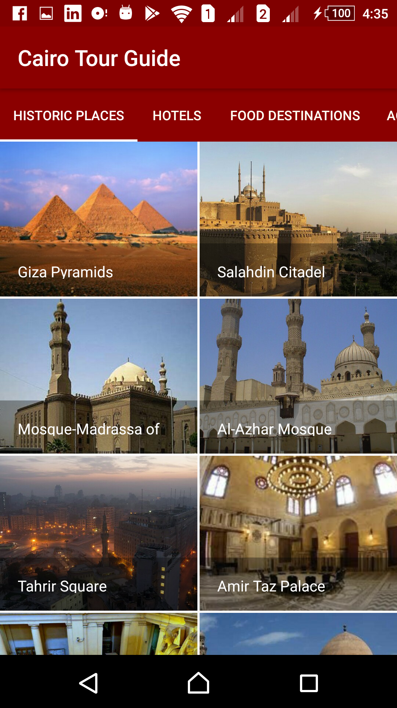
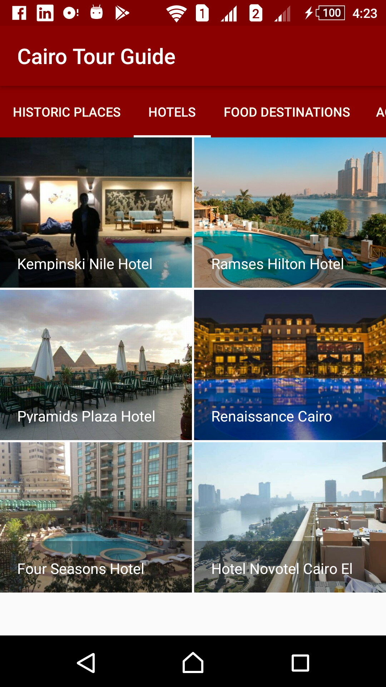
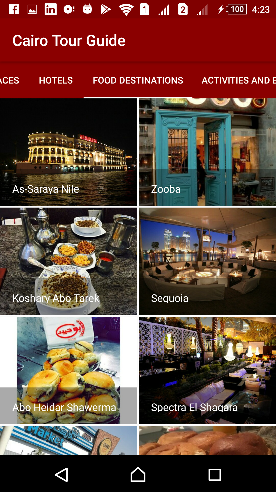
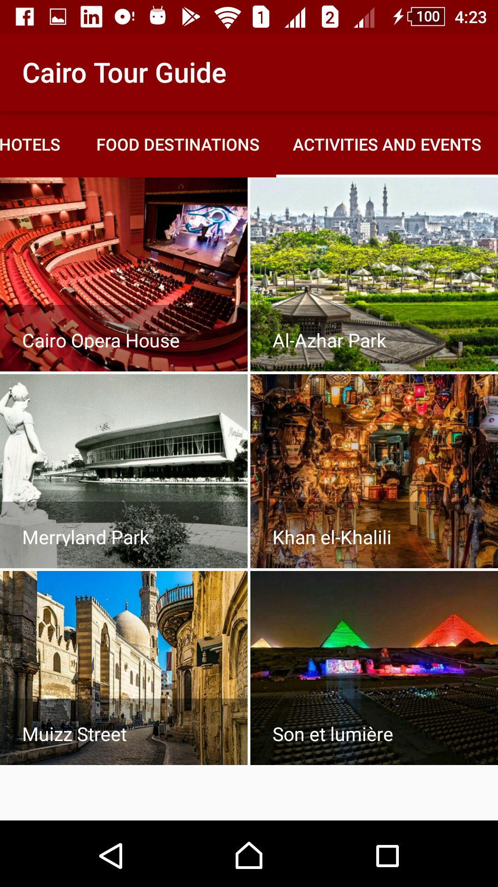
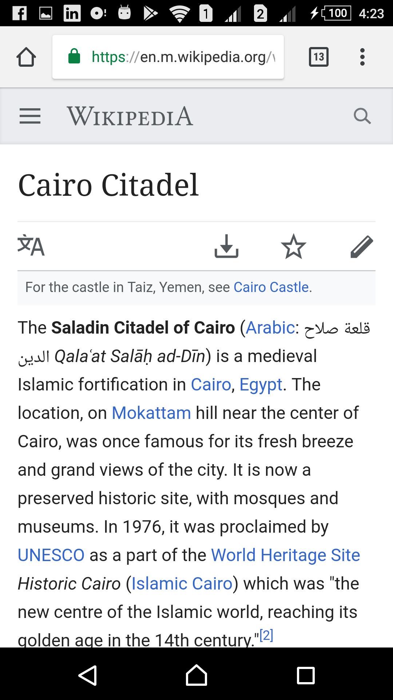

# ABND-Proj5-Cairo-Tour-Guide

The fifth project in the Android Basics nanodegree by Google and Udacity: "**(v3) Musical Structure**".
It is the second and final project in the third course of the nanodegree "Multi-Screen Apps".

***

  

  

***

## Udacity's Project Overview:

You will be making your own multi-screen Android app to share your knowledge about a city you are very familiar with.

The goal is to create a Tour Guide App which presents relevant information to a user who’s visiting your city. The app can list top attractions, restaurants, public places, or events for the city. It can contain all the best known secrets that only locals know. It’s up to you which categories you want to provide, as well as what information to provide in each category. 

 [Project Rubric](https://review.udacity.com/#!/projects/342/view)

## App Overview:

The app is presents tthe top attractions in my city, Cairo. It divides the places and locations into four categories:
	1. Historic Places
	2. Hotels
	3. Food Destinations
	4. Activities and Events
	
Each of the four categories is presented in a Fragment, and a ViewPager is used to switch among them either by a swipe or by pressing the category from above, and I have added a ZoomOutPageTransformer that is triggered upon transformation from one category to another.

The locations in each category are displayed using a GridView.
Opon clicking on a location, a wikipedia link would be opened using an implicit intent having all information on this place (if provided).

## Android Features:

1. Fragments
2. ViewPager and TabLayout
3. FragmentPagerAdapter
4. GridView and ArrayAdapter
5. PageTransformer
6. XML String Arrays

## External Libraries:

1. Glide (Used to load drawables efficiently)

#### Notes:

- Places and locations images are downloaded from various sites on the internet.
- App Icon is downloaded from [Flaticon](www.flaticon.com)
